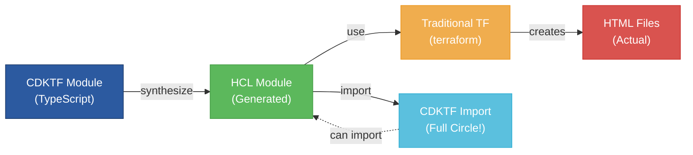

# CDKTF to HCL Module Demonstration

A complete working example demonstrating how to create infrastructure modules with CDKTF that generate HCL modules consumable by both CDKTF and traditional Terraform workflows.

## 🎯 What This Demonstrates

This repository shows a **fully functional workflow** where:

1. **CDKTF** creates HTML files using TypeScript (type-safe infrastructure code)
2. **Synthesizes** to standard Terraform HCL
3. **Extracts** reusable HCL modules
4. **Traditional Terraform** consumes the generated modules
5. **CDKTF** can import the HCL modules back (full circle!)

## 🚀 Quick Start

1. **Install dependencies:**

   ```bash
   npm install
   ```

2. **Run the demo:**

   ```bash
   ./demo-workflow.sh
   ```

3. **Test the generated files:**

   ```bash
   ls -la output/
   cat output/test.html
   ```

4. **View the native HCL output:**

   ```bash
   cat cdktf.out/stacks/SimpleTestStack/cdk.tf
   ```

5. **Package the module for distribution:**
   ```bash
   ./package-module.sh
   ```

## 📁 Generated Files

After running the demo, check the `output/` directory:

- `demo.html` - Created by the CDKTF-generated module (if using defaults)
- Files created via the module use the filename variable you specify

## 🔄 Complete Workflow Demonstrated



## � Key Features

- **Local File Creation**: Uses `@cdktf/provider-local` instead of cloud resources
- **Professional Styling**: Generated HTML includes CSS and responsive design
- **TypeScript Support**: Full type safety with interfaces and strong typing
- **Modular Design**: Reusable HTML file module that can be imported
- **Escape Hatches**: Uses CDKTF escape hatches to control generated HCL structure
- **Demo Workflow**: Complete script showing CDKTF → HCL → Terraform usage
- **Native HCL Output**: CDKTF natively generates HCL using --hcl flag (no conversion needed)
- **Module Packaging**: Creates distributable zip packages for the generated HCL module
- **GitHub Actions**: Automated workflows for building and releasing module packages

## 🎯 Native HCL Generation

CDKTF can now **natively output HCL** using the `--hcl` flag:

```bash
# Generate both JSON and HCL formats
npx cdktf synth --hcl

# View the native HCL output
cat cdktf.out/stacks/SimpleTestStack/cdk.tf
```

### Key Benefits:

✅ **No conversion needed** - Direct HCL output from CDKTF  
✅ **Production ready** - Native HCL is immediately usable  
✅ **Proper syntax** - Real HCL with correct `output` blocks  
✅ **Simplified workflow** - No intermediate conversion steps

### Generated HCL Example:

````hcl
terraform {
  required_providers {
    local = {
      version = "~> 2.0"
      source  = "hashicorp/local"
    }
  }
}

variable "filename" {
  description = "Filename for the HTML file"
  type        = string
  default     = "./output/demo.html"
}

variable "title" {
  description = "Title for the HTML page"
  type        = string
}

variable "message" {
  description = "Message content for the HTML page"
  type        = string
}

resource "local_file" "html_file" {
  filename = var.filename
  content  = "<!DOCTYPE html>..."
}

output "created_file" {
  value       = local_file.html_file.filename
  description = "Path to the created HTML file"
}
```## 📦 Module Distribution

### Local Packaging

Create a distributable zip package of the generated Terraform module:

```bash
npm run package
# or
./package-module.sh
````

This creates:

- `terraform-html-module-{version}.zip` - Ready-to-use module package
- `terraform-html-module-{version}.zip.sha256` - Checksum for verification

### GitHub Actions

Two automated workflows are included:

#### 1. Build Module (`build-module.yml`)

- Triggers on push/PR to main branches
- Generates and validates the module
- Creates artifacts for download

#### 2. Release Module (`release-module.yml`)

- Triggers on version tags (v1.0.0, v2.1.0, etc.)
- Creates GitHub releases with module zip files
- Includes checksums and documentation

#### Using the workflows:

```bash
# Create a release
git tag v1.0.0
git push origin v1.0.0

# The workflow will automatically:
# 1. Generate the HCL module from CDKTF
# 2. Package it as a zip file
# 3. Create a GitHub release with the package
```

### Module Usage

Download and use the packaged module:

```bash
# Download from GitHub releases
curl -L -o terraform-html-module.zip \
  https://github.com/your-repo/releases/download/v1.0.0/terraform-html-module-v1.0.0.zip

# Extract
unzip terraform-html-module.zip -d html-file-module

# Use in your Terraform
module "html_page" {
  source = "./html-file-module"

  filename = "./output/welcome.html"
  title    = "Welcome to Our Site"
  message  = "Welcome to our site! This page was created using a CDKTF-generated module."
}
```

## 🛠️ Project Structure

```
cdktf-module-creation/
├── src/
│   ├── html-file-module.ts          # Legacy construct (for reference)
│   └── index.ts                     # Main synth file (TerraformStack)
├── demo-workflow.sh                 # Complete demo script
├── package-module.sh                # Module packaging script
├── .github/workflows/               # GitHub Actions
│   ├── build-module.yml             # Build and validate module
│   └── release-module.yml           # Release module packages
├── examples/
│   ├── use-generated-module.tf           # Example calling the generated module
│   └── use-cdktf-generated-module.tf     # Detailed usage examples
├── cdktf.out/stacks/SimpleTestStack/  # Generated files (gitignored)
│   ├── cdk.tf                       # Native HCL output (use as module)
│   └── cdk.tf.json                  # JSON output
├── output/                          # Generated HTML files (gitignored)
└── README.md
```

## 🔧 Technical Details

### CDKTF Stack (`src/index.ts`)

- Uses `@cdktf/provider-local` to create files
- Standard `TerraformStack` with `TerraformVariable` for inputs
- Uses escape hatches to remove backend blocks for module generation
- Creates a single HTML file with configurable filename, title, and message
- Generated files include metadata about creation method

### Generated HCL Module (`cdktf.out/stacks/SimpleTestStack/cdk.tf`)

- Generated directly from CDKTF using `cdktf synth --hcl`
- No backend block (removed using escape hatches)
- Uses `local` provider for file creation
- Compatible with all Terraform tooling
- Includes proper variable definitions (filename, title, message) and outputs

### Key Implementation Details

- Uses escape hatches (`addOverride`) to remove backend blocks for module generation
- Simple variable structure: three string variables (filename, title, message)
- Creates a single HTML file resource (not a map/loop pattern)

## 🎪 Live Examples

The generated HTML files demonstrate:

1. **CDKTF Direct Creation**: Shows TypeScript-generated content
2. **Traditional Terraform**: Uses HCL module, displays "Generated by HCL Module"
3. **Team Integration**: Demonstrates existing workflow compatibility

Each file contains:

- Professional styling
- Clear indication of creation method
- Explanatory content about the workflow
- Responsive design

## 🚀 Getting Started

### Prerequisites

- Node.js 18+ and npm
- Terraform CLI
- Basic TypeScript knowledge (optional)

**Note**: This project requires `--legacy-peer-deps` when installing dependencies due to CDKTF version compatibility. Always use `npm install --legacy-peer-deps` or `npm ci --legacy-peer-deps`.

### Run the Demo

1. **Install dependencies**:

   ```bash
   npm install --legacy-peer-deps
   npx cdktf get  # Generate provider code
   ```

2. **Run complete demo**:

   ```bash
   ./demo-workflow.sh
   ```

3. **View results**:
   ```bash
   # View the generated HTML file
   open output/demo.html
   # Or check the module output location
   ls -la output/
   ```

### Manual Steps

You can also run parts of the workflow manually:

```bash
# 1. Create files with CDKTF
npx cdktf synth --hcl
cd cdktf.out/stacks/SimpleTestStack
terraform init && terraform apply -auto-approve
cd ../../..

# 2. Use the generated module in another Terraform configuration
cd examples
terraform init
terraform apply

# 3. View generated files
ls -la output/
```

## 🎯 Use Cases

### Scenario 1: Infrastructure Team Migration

- Team wants to adopt CDKTF for type safety and better tooling
- Existing teams continue using familiar Terraform workflows
- Generated modules provide compatibility bridge

### Scenario 2: Multi-Team Organization

- Platform team creates modules in CDKTF
- Application teams consume with traditional Terraform
- Everyone uses familiar tools, consistent infrastructure

### Scenario 3: Gradual Adoption

- Start with CDKTF for new modules
- Keep existing HCL modules as-is
- Gradually migrate while maintaining compatibility

## 🔍 What Makes This Different

Unlike typical CDKTF examples that focus on cloud resources requiring credentials and complex setup, this example:

- ✅ **Runs Locally**: No cloud accounts or credentials needed
- ✅ **Instant Results**: Creates actual files you can open and view
- ✅ **Complete Workflow**: Shows both directions (CDKTF→HCL and HCL→CDKTF)
- ✅ **Team Focused**: Addresses real organizational adoption challenges
- ✅ **Production Ready**: Demonstrates patterns usable in real projects

## 📚 Learning Resources

- **[CDKTF Documentation](https://www.terraform.io/cdktf)** - Official CDKTF docs
- **[Terraform Registry](https://registry.terraform.io/)** - Module examples
- **[Local Provider](https://registry.terraform.io/providers/hashicorp/local/latest/docs)** - Used in this example

## 🤝 Contributing

This example is designed to be:

- **Self-contained**: Runs without external dependencies
- **Educational**: Clear comments and documentation
- **Extensible**: Easy to modify for your use cases

Feel free to extend this example for your specific needs!

---

**🎉 This demonstrates that CDKTF and traditional Terraform can work together seamlessly, enabling organizations to adopt modern infrastructure-as-code practices without disrupting existing workflows.**
